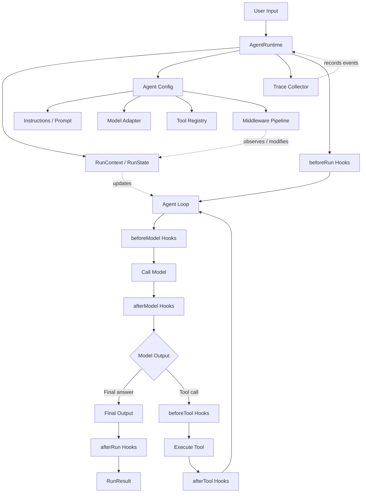
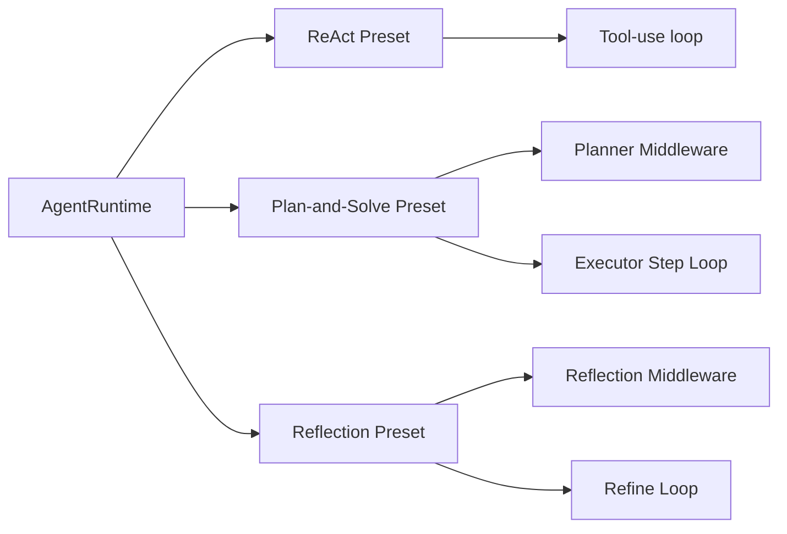

# Agent Runtime Playground Architecture

This document describes the final architecture for Hello Agents as an Agent Runtime Playground.

The goal is to make agent behavior easy to run, inspect, extend, and compare. ReAct, Plan-and-Solve, and Reflection are presets or middleware combinations on top of one shared runtime.

## High-Level Architecture



## Core Modules

```text
src/
  core/
    agent.ts          # Agent definition: name, instructions, model, tools, middleware
    runtime.ts        # Shared execution loop
    model.ts          # Model adapter interface and OpenAI-compatible implementation
    tool.ts           # Tool interface
    tool_registry.ts  # Tool registration, lookup, and execution
    middleware.ts     # Runtime hook interface
    context.ts        # RunContext / RunState
    trace.ts          # RunEvent / TraceCollector / RunResult

  middleware/
    planner.ts        # Adds planning before or during execution
    reflection.ts     # Reviews and refines model output
    retry.ts          # Retries model or tool failures
    guardrail.ts      # Validates model output and tool calls
    logger.ts         # Emits logs and trace events

  agents/
    presets/
      react.ts        # Tool-use loop preset
      plan_and_solve.ts
      reflection.ts

  tools/
    builtin/
      search.ts
```

## Runtime Responsibility

`AgentRuntime` owns the execution loop.

It should:

- Create and update `RunContext`.
- Call lifecycle hooks.
- Render or assemble model input.
- Call the model adapter.
- Parse model output into final output or tool calls.
- Execute tools through `ToolRegistry`.
- Record trace events.
- Stop on final output, max steps, errors, or guardrail decisions.

## Agent Responsibility

`Agent` should be mostly configuration.

It should define:

- `name`
- `instructions`
- `model`
- `tools`
- `middleware`
- runtime options such as `maxSteps`, `temperature`, and `maxTokens`

The execution loop belongs to `AgentRuntime`; `Agent` stays declarative and portable.

## Middleware And Hooks

Middleware is the main extension point.

```text
beforeRun
beforeModel
afterModel
beforeTool
afterTool
afterRun
onError
```

Typical runtime capabilities should be middleware:

- Planning
- Reflection
- Retry
- Guardrails
- Logging
- Trace export
- Human approval
- Memory injection

## Preset Mapping

Agent patterns are packaged as presets over the shared runtime.



## Example Usage

```ts
const agent = new Agent({
  name: "research-agent",
  instructions: "Answer with concise reasoning and cite tool observations.",
  model,
  tools: [searchTool],
  middleware: [
    planner(),
    reflection({ maxIterations: 2 }),
    tracer(),
  ],
});

const result = await runtime.run(agent, {
  input: "Research TypeScript agent runtime design.",
});
```

## Design Direction

The architecture shape is:

```text
Agent + Runtime + Model + Tool + Middleware + Trace + State
```

ReAct, Plan-and-Solve, and Reflection are reusable runtime behavior instead of separate runtime implementations.
